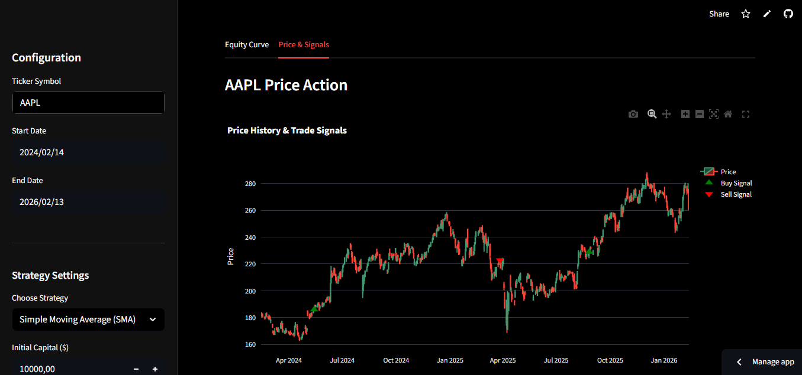

<div align="center">
  
</div>


<div align="center">
  
</div>


## Live Demo

[Quant Trading Strategy Backtester](https://quant-trading-strategy-backtester-ayoub-aguezar.streamlit.app/)


# Quant Trading Strategy Backtester   

A professional-grade quantitative trading backtesting engine built with Python and Streamlit. This application allows users to test technical analysis strategies on historical financial data with a modern, interactive dashboard.


## Overview

The Quant Trading Strategy Backtester provides a robust platform for analyzing trading strategies against historical market data. It features a clean, intuitive interface and powerful analytics to help traders evaluate performance metrics and visualize results.

## Features

- **Data Fetching**: 
  - Real-time historical data for stocks (e.g., AAPL, MSFT) and crypto (e.g., BTC-USD, ETH-USD) via `yfinance`.
- **Strategies**:
  - **Simple Moving Average (SMA) Crossover**: Captures trends by comparing short-term and long-term moving averages.
  - **Relative Strength Index (RSI)**: Identifies overbought and oversold conditions for mean reversion trading.
- **Backtesting Engine**:
  - **Realistic Simulation**: Accounts for initial capital and transaction costs (commissions).
  - **Portfolio Management**: Tracks cash, positions, and total equity over time.
  - **Benchmark Comparison**: Automatically compares strategy performance against a "Buy & Hold" strategy.
- **Advanced Analytics**:
  - **KPI Metrics**: Total Return, CAGR, Volatility, Sharpe Ratio, Max Drawdown.
  - **Trade Analysis**: detailed trade logs and Win Rate calculation.
- **Visualization**:
  - Interactive **Plotly** charts.
  - Candlestick charts with precise Buy/Sell markers.
  - Interactive Equity Curve and Drawdown analysis.

## Project Structure

- `app.py`: The main Streamlit application entry point.
- `backtest.py`: Core backtesting engine class handling logic and portfolio tracking.
- `strategies.py`: Implementation of trading logic (SMA, RSI).
- `data.py`: Data fetching and cleaning utility.
- `metrics.py`: Financial performance calculations.
- `plots.py`: Visualization modules using Plotly.

## Tech Stack

<div align="center">

<table>
  <tr>
    <th align="center">Category</th>
    <th align="center">Technology</th>
    <th align="center">Icon</th>
  </tr>

  <tr>
    <td align="center">Backend & Framework</td>
    <td align="center">Python 3.10+</td>
    <td align="center">
      
    </td>
  </tr>

  <tr>
    <td align="center">Backend & Framework</td>
    <td align="center">Streamlit</td>
    <td align="center">
      
    </td>
  </tr>

  <tr>
    <td align="center">Data & Analysis</td>
    <td align="center">yfinance</td>
    <td align="center">
      
    </td>
  </tr>

  <tr>
    <td align="center">Data & Analysis</td>
    <td align="center">pandas</td>
    <td align="center">
      
    </td>
  </tr>

  <tr>
    <td align="center">Data & Analysis</td>
    <td align="center">NumPy</td>
    <td align="center">
      
    </td>
  </tr>

  <tr>
    <td align="center">Visualization</td>
    <td align="center">Plotly</td>
    <td align="center">
      
    </td>
  </tr>

  <tr>
    <td align="center">Deployment</td>
    <td align="center">Streamlit Cloud</td>
    <td align="center">
      
    </td>
  </tr>

  <tr>
    <td align="center">Version Control</td>
    <td align="center">GitHub</td>
    <td align="center">
      
    </td>
  </tr>

</table>

</div>


## Installation & Usage

1. **Clone the repository**:
   ```bash
   git clone <repository_url>
   cd QuantTradingBacktester
   ```

2. **Install dependencies**:
   ```bash
   pip install -r requirements.txt
   ```

3. **Run the application**:
   ```bash
   streamlit run app.py
   ```

4. **Navigate**: Open your browser to the URL shown in the terminal (usually `http://localhost:8501`).

## Disclaimer

**Educational Use Only**: This software is provided for educational and informational purposes only. It does not constitute financial advice. Trading in financial markets involves a high degree of risk and may result in the loss of your entire investment. The authors are not responsible for any financial losses incurred from using this software.
